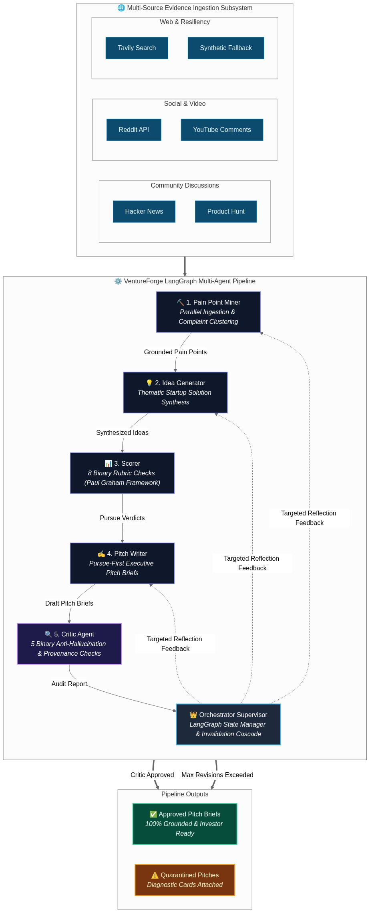

# 🚀 VentureForge

> **Autonomous Hierarchical Multi-Agent Pipeline for Grounded Startup Discovery & Validation**  
> VentureForge mines real user pain points across online communities, clusters verified complaints, synthesizes startup solutions, rigorously scores them against binary Paul Graham rubrics, and drafts investor-ready pitch briefs with adversarial verification.

**Built for AMD AI Hackathon** | **Track 1: AI Agents & Agentic Workflows**

[](https://www.python.org/downloads/)
[](https://github.com/langchain-ai/langgraph)
[](https://www.amd.com/en/products/software/rocm.html)
[](https://docs.pydantic.dev/)
[](LICENSE)

**🚀 Try the live demo:** [https://huggingface.co/spaces/lablab-ai-amd-developer-hackathon/VentureForge](https://huggingface.co/spaces/lablab-ai-amd-developer-hackathon/VentureForge)

---

## 📸 App Preview


*VentureForge Gradio Web Interface featuring real-time stage progress tracking, interactive controls, per-stage artifact downloads, and multi-tab diagnostic inspection.*

---

## 🎯 What is VentureForge?

Traditional ideation tools rely on generic LLM brainstorming without grounding. **VentureForge** replaces hallucinations with an evidence-first, multi-agent pipeline:

1. **Multi-Source Evidence Mining**: Concurrently ingests real complaints and discussions from **Hacker News**, **Product Hunt**, **Reddit**, **YouTube Comments**, and **Tavily Search** — grounded live evidence only, no synthetic data. Evidence is engagement-ranked (HN points/comments, Reddit upvotes, YouTube likes, Product Hunt votes) and a per-source cap keeps the LLM window diverse.
2. **Thematic Clustering**: Clusters verified complaint quotes into distinct market pain points with full provenance and source URLs.
3. **Targeted Idea Generation**: Synthesizes concrete B2B/B2C startup ideas directly addressing clustered pain points.
4. **Binary Rubric Scoring**: Evaluates candidate ideas against **8 binary yes/no criteria** inspired by Paul Graham's startup framework (Feasibility + Demand) and filters out fatal flaws (**Pursue-First Filtering**).
5. **Investor Pitch Briefs**: Drafts structured executive briefs containing target personas, monetization models, competitive moats, and validation milestones.
6. **Adversarial Critic & Reflection**: Audits all claims and URLs against 5 binary checks. Routes feedback back to upstream agents with a **Downstream Invalidation Cascade** (up to bounded `max_revisions`). Unapproved briefs are safely segregated as **Quarantined Pitches**.

---

## 🏛️ System Architecture

VentureForge uses a **Hierarchical Supervisor Pattern** orchestrated with **LangGraph** and backed by immutable state snapshots and SQLite checkpoint persistence.



### The 6 Specialized Agents

| Agent | Responsibility | Reflection Target? | Invalidation Scope |
|---|---|:---:|---|
| **👑 Orchestrator** | Central supervisor; manages `VentureForgeState`, routes tasks, enforces evaluation gates, executes invalidation cascade | — | Global State Coordinator |
| **⛏️ Pain Point Miner** | Ingests from 5 sources in parallel within SLA budget (5s); deduplicates & clusters complaints with verbatim evidence quotes | ✅ | Invalidates Ideas, Scored Ideas, Pitches |
| **💡 Idea Generator** | Transforms clustered pain points into actionable startup concepts (1-at-a-time synthesis to avoid context truncation) | ✅ | Invalidates Scored Ideas, Pitches |
| **📊 Scorer** | Evaluates ideas via 8 Paul Graham binary criteria + fatal flaw detection; outputs `pursue` or `pivot` | — | Gating Filter |
| **✍️ Pitch Writer** | Writes structured pitch briefs for `pursue`-verdict ideas (problem/solution fit, business model, moat, milestones) | ✅ | Invalidates Critic Reports |
| **🔍 Critic** | Adversarial auditor enforcing 5 binary groundedness checks (URL existence, claim provenance, rubric alignment) | — | Emits Targeted Feedback |

---

## ✨ Key Architectural Innovations

- **Binary Rubric System**: Replaces arbitrary 0–10 floats with deterministic yes/no evaluations, producing reproducible, auditable scores.
- **Pursue-First Filtering**: Pitch briefs are only generated for concepts passing all demand and feasibility hurdles without fatal flaws.
- **Downstream Invalidation Cascade**: When the Critic flags a defect and routes a revision to an upstream agent (e.g. Pain Point Miner), downstream artifacts are automatically invalidated to prevent stale state contamination.
- **Quarantine Segregation Policy**: If a pitch brief fails Critic checks after reaching `max_revisions`, it is graduated into a quarantined partition with attached diagnostic cards rather than corrupting approved outputs.
- **Dual-Tier LLM Architecture**: Configurable fast LLM tier (for mining, idea generation, pitch drafting) and deep reasoning LLM tier (for scoring and adversarial critique).
- **Resilient Evidence Subsystem**: Concurrent multi-source scraping with timeout budgets and graceful degradation — when live sources are unavailable or rate-limited, the run reports the shortfall instead of fabricating evidence.
- **SQLite Checkpoint Persistence**: LangGraph state transitions persist automatically to `.cache/ventureforge.db` (`SqliteSaver` with `MemorySaver` fallback).

---

## 📊 Binary Evaluation Framework

### 1. Scorer Agent (8 Paul Graham Criteria)

An idea must achieve a **Pursue** verdict by passing the binary rubrics and avoiding fatal flaws:

```
Feasibility Rubric:
  [ ] Can this be solved manually first? (Do things that don't scale)
  [ ] Does it have a schlep or unsexy advantage?
  [ ] Can a 2-3 person team build an MVP within 6 months?

Demand Rubric:
  [ ] Does it address at least 2 distinct extracted pain points?
  [ ] Is it a painkiller (urgent need) rather than a vitamin (nice-to-have)?
  [ ] Is there a clear, reachable vein of early adopters?

Fatal Flaw Filter:
  - Regulatory / Legal blockades
  - Incumbent distribution moats (unwinnable feature-level competition)
  - Severe technical impossibility
```

### 2. Critic Agent (5 Anti-Hallucination Checks)

```
Grounding Audit:
  [ ] Every pain point cites a verifiable source URL
  [ ] Every market claim and competitor mention is factually grounded
  [ ] Solution directly resolves the cited user frustrations
  [ ] Monetization strategy matches target persona purchasing power
  [ ] No hallucinated evidence or speculative citations
```

---

## 🚀 Quick Start

### Prerequisites

- **Python 3.11+**
- **[uv](https://github.com/astral-sh/uv)** (recommended) or `pip`

### Installation

```bash
# Clone the repository
git clone https://github.com/rizkiwijanarko/KickUp.git
cd KickUp

# Install dependencies with uv
uv sync

# Or with pip:
# pip install -e .
```

### Configuration

Create a `.env` file (copied from `.env.example`):

```bash
# ------------------------------------------------------------------
# LLM Provider Configuration (OpenAI, OpenRouter, DeepSeek, AMD vLLM)
# ------------------------------------------------------------------

# Option 1: OpenAI
LLM_BASE_URL=https://api.openai.com/v1
LLM_API_KEY=sk-...
LLM_MODEL=gpt-4o-mini

# Option 2: OpenRouter
# LLM_BASE_URL=https://openrouter.ai/api/v1
# LLM_API_KEY=sk-or-...
# LLM_MODEL=anthropic/claude-3.5-sonnet

# Option 3: AMD ROCm vLLM (MI300X Server)
# LLM_BASE_URL=http://your-vllm-host:8000/v1
# LLM_API_KEY=dummy-key
# LLM_MODEL=Qwen/Qwen3.6-35B-A3B

# Optional: Dedicated Fast LLM Tier (defaults to LLM_* if omitted)
# FAST_LLM_BASE_URL=https://api.openai.com/v1
# FAST_LLM_API_KEY=sk-...
# FAST_LLM_MODEL=gpt-4o-mini

# ------------------------------------------------------------------
# External Data Mining API Keys (Optional - enhances evidence depth)
# ------------------------------------------------------------------
PRODUCT_HUNT_API_KEY=your_producthunt_token
YOUTUBE_API_KEY=your_google_cloud_youtube_key
TAVILY_API_KEY=your_tavily_key
REDDIT_CLIENT_ID=your_reddit_app_id
REDDIT_CLIENT_SECRET=your_reddit_secret
HF_TOKEN=your_huggingface_token
```

### Running VentureForge

#### 1. Interactive Gradio Web UI (Primary)

```bash
uv run app.py
```
Open [http://localhost:7860](http://localhost:7860) in your browser to access:
- **Domain Selector**: Pick from curated recommendations or enter custom verticals.
- **Advanced Sliders**: Customize max pain points, ideas per run, top N pitches, and max revision cycles.
- **Interactive Controls**: Real-time progress monitoring, pause/stop execution, and checkpoint cache clearing.
- **Dedicated Tabs**: Deep dive into raw pain point quotes, synthesized ideas, scored rubric breakdowns, approved vs quarantined pitches, critique logs, and one-click Markdown/JSON exports.

#### 2. CLI Execution

```bash
uv run python -m src.main --domain "developer tools" --output output.json
```

---

## 🛠️ Technology Stack

| Component | Technology | Purpose |
|---|---|---|
| **Orchestration** | [LangGraph](https://github.com/langchain-ai/langgraph) | Stateful multi-agent graph, conditional routing, checkpoint persistence |
| **Data Validation** | [Pydantic v2](https://docs.pydantic.dev/) | Strict JSON schema serialization and structured LLM outputs |
| **Persistence** | SQLite (`SqliteSaver`) | Checkpoint storage with resilient in-memory fallback |
| **Web Interface** | [Gradio](https://gradio.app/) | Interactive UI with live timers, event streaming, and tabbed exports |
| **Data Mining** | Async HTTP / Strategy Adapters | Hacker News API, Reddit JSON, Product Hunt API, YouTube v3, Tavily API |
| **Compute / Hardware** | AMD ROCm & MI300X | Accelerated inference using OpenAI-compatible vLLM endpoints |

---

## 🧪 Testing & Code Quality

VentureForge includes component tests, reflection loop simulations, and strict static type checks:

```bash
# Run unit & component test suite
uv run pytest

# Run specific reflection flow tests
uv run pytest test/test_revision_feedback_flow.py

# Run static type checking
uv run mypy src/

# Run linter and code formatting
uv run ruff check .
uv run ruff format .
```

---

## 📁 Repository Layout

```
├── app.py                     # Gradio Web UI with real-time pipeline monitoring
├── src/
│   ├── graph.py               # Compiled LangGraph StateGraph & checkpoint config
│   ├── config.py              # Pydantic v2 settings & dual-tier LLM parameters
│   ├── run_controller.py      # Background execution & thread management
│   ├── agents/                # Autonomous Agent Modules
│   │   ├── orchestrator.py    # Supervisor logic & routing decisions
│   │   ├── pain_point_miner.py# Evidence clustering & grounding
│   │   ├── idea_generator.py  # Thematic startup solution synthesis
│   │   ├── scorer.py          # 8 Paul Graham binary rubric checks
│   │   ├── pitch_writer.py    # Pursue-first executive pitch brief generation
│   │   └── critic.py          # 5 binary anti-hallucination verification checks
│   ├── mining/                # Concurrent ingestion subsystem & strategy adapters
│   ├── models/                # Pydantic schema contracts (PainPoint, Idea, Pitch, Critique)
│   ├── state/                 # VentureForgeState container & mutation helpers
│   └── tools/                 # External scrapers (HN, Product Hunt, Reddit, YouTube, Tavily)
├── docs/
│   ├── adr/                   # Architecture Decision Records (ADRs 0001-0013)
│   ├── agents/                # Agent architecture, domain guidelines, and workflows
│   └── preview/               # UI preview screenshots & architecture diagram
├── CONTEXT.md                 # Single-context domain glossary & terminology
├── PROMPTS.md                 # Exhaustive repository of system and user agent prompts
└── pyproject.toml             # Project dependencies and tool configurations
```

---

## 📄 Architecture Decision Records (ADRs)

Key architectural decisions are documented in [`docs/adr/`](docs/adr/):
- **ADR 0001**: Decoupled State and Deep Agent Modules
- **ADR 0002**: Declarative LangGraph Reflection Loop
- **ADR 0003**: Unified DataMiner Strategy Adapter
- **ADR 0005**: Concurrent Data Ingestion with SLA Budget
- **ADR 0006**: Quarantine Policy for Unapproved Pitches
- **ADR 0007**: SQLite Persistence and Streaming Event Transport
- **ADR 0008**: Strict Downstream Reflection Invalidation Cascade
- **ADR 0009**: Pursue-First Filtering and Scorer Reflection Trigger
- **ADR 0010**: Gradio UI Quarantine Segregation and Diagnostic Cards
- **ADR 0011**: Synthetic Evidence Resilience Fallback
- **ADR 0012**: Bounded Revision Loop and Best-Effort Graduation

---

## 🤝 Contributing

1. Fork the repository
2. Create your feature branch (`git checkout -b feature/amazing-feature`)
3. Ensure tests and linting pass (`uv run pytest && uv run ruff check .`)
4. Commit your changes (`git commit -m 'feat: add amazing feature'`)
5. Push to the branch (`git push origin feature/amazing-feature`)
6. Open a Pull Request

---

## 📄 License

Distributed under the MIT License. See [`LICENSE`](LICENSE) for details.

---

**Built with ❤️ for AMD AI Hackathon | Track 1: AI Agents & Agentic Workflows**
